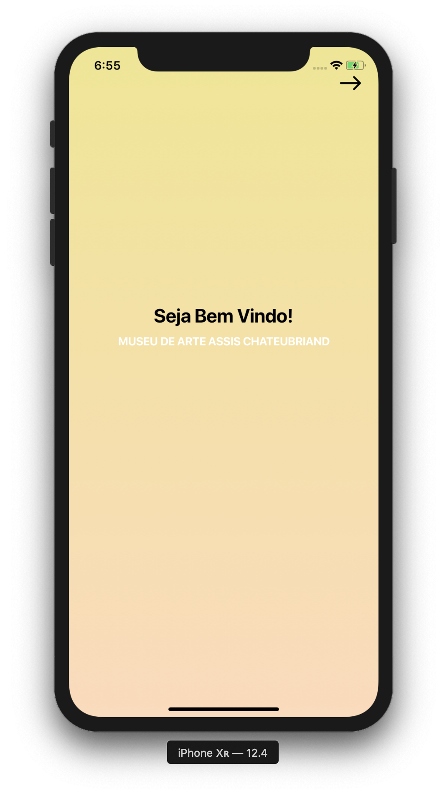

# museumApp
In this first phase it was created just a prototype of the screens of the app made for the museum of Campina Grande (MMAC). In the second implementation will be used iBeacon which is a bluetooth proximity device.

<ul>
  <li>screen One</li>
</ul>

screen Two

screen Three

screen Four

