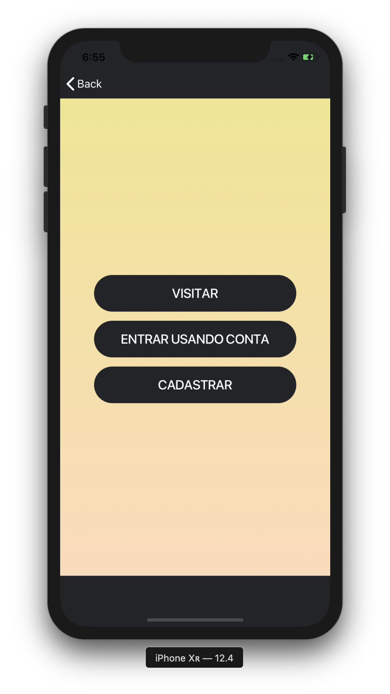
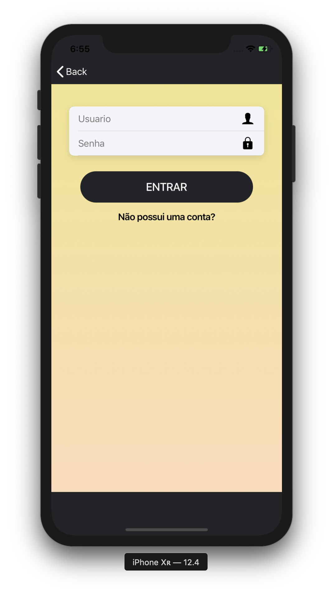

# museumApp
In this first phase it was created just a prototype of the screens of an app made for the museum of Campina Grande (MMAC). 
<ul>
  <li>SCREEN ONE</li>
</ul>

<ul>
  <li>SCREEN TWO</li>
</ul>

<ul>
  <li>SCREEN THREE</li>
</ul>

<ul>
  <li>SCREEN FOUR</li>
</ul>

<ul>
  <li>SCREEN FIVE</li>
</ul>

<ul>
  <li>SCREEN SIX</li>
</ul>

